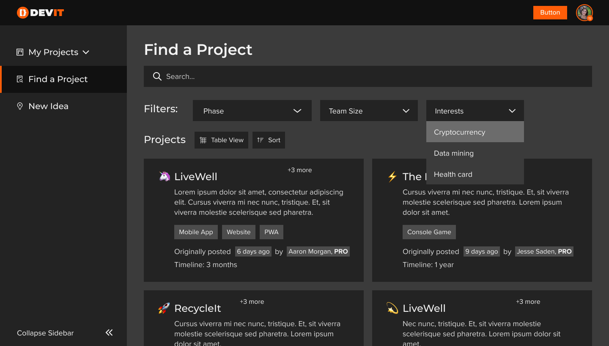

# DevIt

## The Team

[*how?*](https://help.github.com/articles/about-readmes/#relative-links-and-image-paths-in-readme-files)

_TODO: short project description, some sample screenshots or mockups_

### Project Description

Devit is a community platform focused on facilitating connections between developers, desginers and innovators. The platform aims at forming teams to help budding designers and engineers gain project experience as well as to help innovators' ideas come to life. The platform consists of a Project page where users are able to post project ideas as well as join onto exisiting projects. Devit also provides a platform for users to keep track of their projects and earn badges as they make more progress. 

### Complete figma mockup 

[Figma mockup](https://www.figma.com/file/6sZtOJFTGTyQ3ugzVtJsVW/HiFi-Sketches?node-id=0%3A1)

## Architecture

_TODO: descriptions of code organization and tools and libraries used_

### Tools
| Purpose                   | Library                        | Comments                                                                                             |
|---------------------------|--------------------------------|------------------------------------------------------------------------------------------------------|
| Routing                   | React Router, React Router DOM | Enables serving up different components based on our own static/dynamic routes                       |
| State Management          | Redux, React Redux             | Provides subscription-based state and helps avoid prop-drilling                                      |
| Data Fetching             | Axios                          | Straightforward syntax for fetching data over HTTP                                                   |
| Asynchronous Stat Updates | Redux Thunk                    | ⚡️ Supercharges Redux store so it can handle functions, enabling state updates with asynchronous data  |

## Setup

_TODO: how to get the project dev environment up and running, npm install etc_
1. Clone Project
2. Run `npm i` to install project dependencies
3. Run `npm start` to start the project at `http://localhost:8080`

## Deployment

_TODO: how to deploy the project_

### Deploying the Client

_DevIt_ is hosted on Netlify using continuous deployment on the `master` branch.

[devit-21s.netlify.app](devit-21s.netlify.app)

### Deploying the Server

The _DevIt API_ is hosted on Netlify using continuous deployment on the `master` branch of the [_DevIt API_ repository](https://github.com/dartmouth-cs52-21S/project-api-devit).

## Authors

- [Lily Maechling](https://github.com/lilymaechling)
- [Scott Gibbons](https://github.com/ScottGibbons00)
- [Henry Mans](https://github.com/henrymans)
- [Nina Paripovic](https://github.com/ninaparipovic)
- [San'Quan Prioleau](https://github.com/sprioleau)

## Acknowledgments
